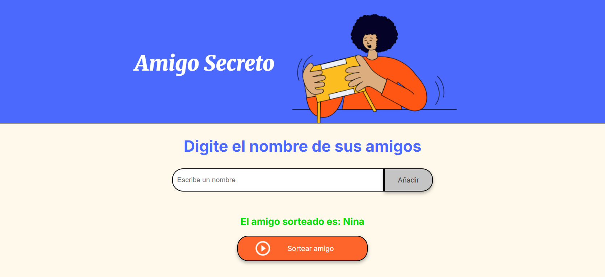

Challenge: Amigo Secreto
Mi primer proyecto en JavaScript que agrega amigos (a una lista) y sortea un "amigo secreto".

¿Qué hace?

1)Agregar amigos a la lista.  
2)Mostrar la lista de amigos.  
3)Sortear un amigo secreto de manera aleatoria.  

Para descargar y usar el repo:  
git clone https://github.com/JFRo57/Amigo_Secreto.git  
cd Amigo_Secreto  
Abre el index.html en tu navegador, es el archivo principal.  

¿Qué tecnologías se aplicaron aquí?  
-HTML  
-CSS  
-JavaScript  
-Git Hub  